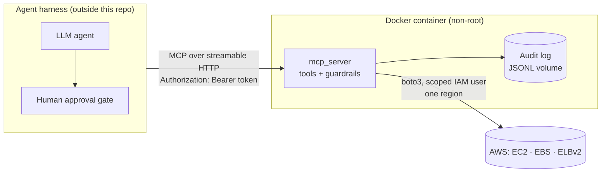
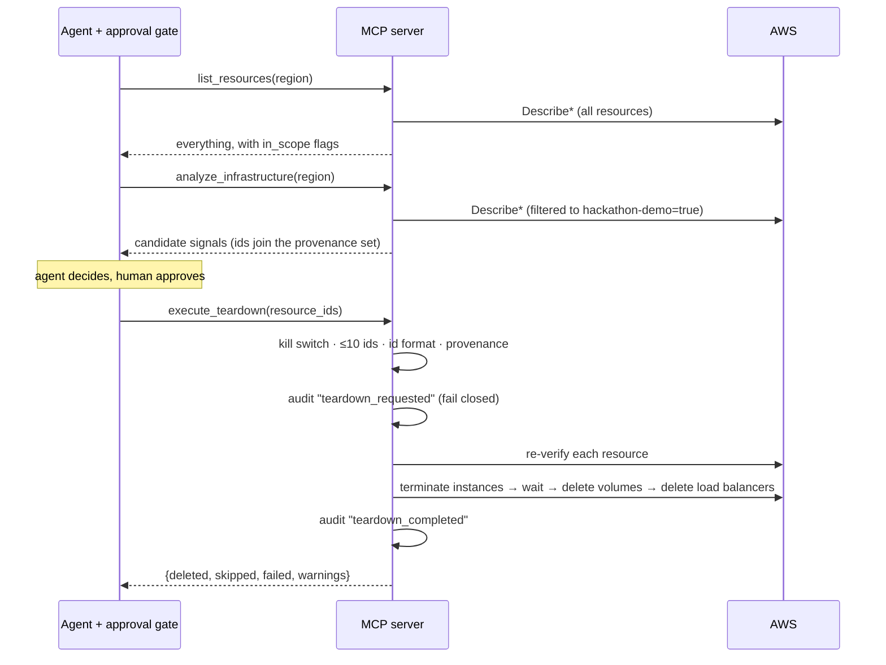

# mcp-s2sep

test-mcp-truefoundry

The MCP tool server for [Cloud Cost Janitor](https://github.com/ilesh32/hackculture-26sep):
three AWS tools — inventory, read-only scanning, and gated teardown — with no
cost logic and no LLM code. Extracted into its own repo so it runs as a
standalone MCP process rather than a locally-imported module, which is the
shape MCP servers are meant to run in.

## Architecture

### Where it sits

The server is a thin, safety-focused execution layer. The agent (LLM plus
harness) decides *what* to clean up; this server decides only whether a
request is *allowed* and then carries it out against AWS.



Responsibilities are split deliberately:

| Layer | Owns | Does **not** own |
| --- | --- | --- |
| Agent / harness | Deciding what is waste, human approval before `execute_teardown` | Enforcing safety invariants |
| This server | Authentication, provenance, tag/region scope, blast-radius cap, re-verification, audit, kill switch | Cost logic, approval, LLM reasoning |
| AWS IAM | Final backstop: least-privilege actions, tag-conditioned deletes | — |

### Components

```
                    ┌──────────────────────────── mcp_server/ ─────────────────────────────┐
 MCP client ──HTTP──▶ http_auth.py  ─▶  server.py ─┬─▶ inventory.py ──┐                       │
   (bearer)         │  bearer check     tool defs   ├─▶ analyzer.py  ──┼─▶ aws_client.py ─▶ AWS│
                    │  /healthz open    error       └─▶ teardown.py ───┘   boto3 factory       │
                    │                   mapping            │  ▲                               │
                    │                   provenance set ────┘  │ re-verify via analyzer helpers│
                    │                                         ▼                               │
                    │                                     audit.py ─▶ JSONL file              │
                    │  debug.py: tool logging + per-call AWS request/response logging        │
                    └─────────────────────────────────────────────────────────────────────────┘
```

| Module | Role |
| --- | --- |
| `server.py` | Builds the `MCPServer`, registers the three tools and `/healthz`, owns the **provenance set** (in-memory), maps expected failures to caller-visible `ToolError`s, starts stdio or HTTP transport. |
| `http_auth.py` | Pure-ASGI bearer-token middleware (constant-time compare). Wraps the whole HTTP app; only `GET /healthz` is exempt. |
| `inventory.py` | `list_resources`: unfiltered read-only listing, with an `in_scope` flag. |
| `analyzer.py` | `analyze_infrastructure`: tag-scoped detection of stopped instances, `available` volumes, load balancers with empty target groups. Its helpers (`_is_demo_scoped`, `count_empty_target_groups`) are reused by teardown so "what the scan flags" and "what teardown re-verifies" cannot drift apart. |
| `teardown.py` | `execute_teardown`: guardrails → provenance → re-verification → ordered deletes → result. |
| `aws_client.py` | Single boto3 client factory: one region from `AWS_REGION`, 5s connect / 30s read timeouts, standard retries. |
| `audit.py` | Append-only JSONL writer. |
| `debug.py` | `MCP_DEBUG` logging: tool calls, and every AWS request/response/error via boto3 event hooks (no secrets). |

### The agent workflow



### Teardown pipeline

`execute_teardown` is the only destructive path, and it is a strict pipeline.
Each stage can only *narrow* what happens next:

1. **Guardrails** — kill switch off, ids non-empty, de-duplicated, at most 10, each id is `i-*`, `vol-*` or an ELB ARN.
2. **Provenance** — every id must be in the set filled by `analyze_infrastructure` in this process. `list_resources` deliberately does **not** feed this set, so browsing the inventory never grants delete rights.
3. **Serialize** — one teardown at a time per process (lock).
4. **Audit intent** — `teardown_requested` is written first. If the log can't be written, the call fails and nothing is touched (**fail closed**).
5. **Re-verify** — re-read each resource from AWS: instance still `stopped`, volume still `available`, load balancer still has an empty target group, and it still carries `hackathon-demo=true`. Anything else (changed, untagged, already gone) is **skipped with a reason**, never forced.
6. **Delete in dependency order** — terminate instances → wait for `terminated` (up to 3 min) → delete volumes → delete load balancers. A failure is recorded per resource and does not abort the others.
7. **Audit outcome + result** — `teardown_completed`, then `{deleted, skipped, failed, warnings, executed_at}` is returned. Deleted ids are removed from the provenance set so they cannot be resubmitted.

### Trust boundaries and state

- **Untrusted input**: every tool argument. The LLM may hallucinate or be prompt-injected, so ids are never trusted by themselves (provenance) and never trusted to still be valid (re-verification).
- **State**: the provenance set is in process memory, so **one server instance = one reasoning session**. It is lost on restart, which fails safe (teardown is refused until a fresh scan). The only persistent state is the audit log (Docker volume at `/app/data`).
- **Scope**: single region (`AWS_REGION`; a different `region` argument is rejected) and, for anything destructive, the `hackathon-demo=true` tag.
- **Layered defence**: even if every server check failed, the IAM policy is the last line — least-privilege actions with tag conditions on the delete actions.

### Failure handling

Expected failures — guardrail rejections, bad input, region mismatch, AWS API errors — return as `isError` results carrying the actual reason, so an agent can react. Unexpected crashes are logged server-side with a full traceback (the MCP SDK deliberately hides crash text from the client and shows only a generic message).

## Tools

- **`list_resources(region: str) -> JSON`** — read-only inventory of *all* EC2
  instances, EBS volumes and load balancers in the configured region, any
  state, tagged or not, each with its tags, state and an `in_scope` flag
  (tagged `hackathon-demo=true`). Listing does not make a resource eligible
  for teardown; only `analyze_infrastructure` output does.
- **`analyze_infrastructure(region: str) -> JSON`** — read-only boto3 scan
  for stopped EC2 instances, orphaned EBS volumes, and idle load balancers,
  scoped to resources tagged `hackathon-demo=true`. Returns raw signals, not
  a verdict — the calling agent decides what's safe to flag.
- **`execute_teardown(resource_ids) -> JSON`** — the destructive tool.
  **Deletes are real and permanent; there is no dry-run mode.** See
  [Teardown pipeline](#teardown-pipeline). Hard-capped at 10 resources per
  call. Returns `{deleted, skipped, failed, warnings, executed_at}` with a
  reason per skipped/failed resource.

## Repository structure

```
mcp_server/
├── server.py       # MCP server (mcp SDK v2): registers the tools, stdio/HTTP transport, /healthz
├── http_auth.py    # bearer-token ASGI middleware for the HTTP transport
├── debug.py        # MCP_DEBUG logging: every AWS call, request and response
├── aws_client.py   # boto3 session/client factory, region config, timeouts/retries
├── inventory.py    # list_resources logic
├── analyzer.py     # analyze_infrastructure logic
├── teardown.py     # execute_teardown: provenance check, re-verify, dependency ordering
└── audit.py        # append-only JSONL logger
tests/
├── test_analyzer.py   # moto-mocked, no real AWS calls
├── test_inventory.py  # moto-mocked list_resources
├── test_teardown.py   # moto-mocked: real deletes, re-verification skips, guardrails, fail-closed audit
└── test_http_auth.py  # bearer middleware
scripts/
├── deploy_local.sh    # build + run the container locally (up|down|logs)
└── test_deployed.py   # live end-to-end test against the running container
Dockerfile            # container build for the streamable-http deployment
requirements.txt      # runtime dependencies (what the image installs)
requirements-dev.txt  # + pytest and moto
```

## Setup

```bash
python -m venv .venv && source .venv/bin/activate
pip install -r requirements-dev.txt   # runtime only: requirements.txt
cp .env.example .env
# fill in AWS_ACCESS_KEY_ID / AWS_SECRET_ACCESS_KEY / AWS_REGION
```

### AWS IAM — least privilege

Read-only tools (`list_resources`, `analyze_infrastructure`, and the
re-verification and terminate-wait inside `execute_teardown`) need only:
`ec2:DescribeVolumes`, `ec2:DescribeInstances`,
`elasticloadbalancing:DescribeLoadBalancers`,
`elasticloadbalancing:DescribeTargetGroups`,
`elasticloadbalancing:DescribeTargetHealth`,
`elasticloadbalancing:DescribeTags`.

Destructive tool additionally needs only:
`ec2:TerminateInstances`, `ec2:DeleteVolume`,
`elasticloadbalancing:DeleteLoadBalancer`.

No `*` actions, no other services. Add tag-scoped conditions
(`aws:ResourceTag/hackathon-demo = true`) to the three delete actions so IAM
enforces the same fence as the server. A missing permission surfaces as a
failed resource with the AWS error text.

## Running tests

```bash
pytest tests/
```

All unit tests run against [moto](https://github.com/getmoto/moto)-mocked AWS —
no real AWS calls, no credentials required. `scripts/test_deployed.py` is the
separate live test (see below).

## Safety guardrails

- **Provenance allowlist** — rejects any resource id not returned by
  `analyze_infrastructure` earlier in the session.
- **Blast-radius cap** — hard limit of 10 resources per `execute_teardown`
  call.
- **Region/tag scope fence** — every tool acts only in the configured
  `AWS_REGION`; `analyze_infrastructure` and teardown only ever act on
  resources tagged `hackathon-demo=true` (`list_resources` shows everything,
  read-only, and flags which are in scope).
- **Re-verification before delete** — re-checks state, tag and target groups
  immediately before deleting; mismatches are skipped, not forced.
- **Fail-closed audit** — intent is logged before any delete; an unwritable
  log blocks the teardown.
- **Authenticated transport** — the HTTP transport refuses to start without
  `MCP_AUTH_TOKEN` (≥16 chars) and rejects every request lacking
  `Authorization: Bearer <token>`; only `GET /healthz` is open.
- **Serialized teardown** — one `execute_teardown` at a time per process.
- **Kill switch** — set `TEARDOWN_DISABLED=true` to hard-disable the
  destructive tool at any time, independent of any harness config.

## Using this from an agent harness

Point your harness's MCP tool registration at this repo (as an external
process, not a local import) and wire an approval gate in front of
`execute_teardown` — this server enforces its own safety invariants
(provenance, blast-radius cap, kill switch) but does **not** enforce human
approval itself. That belongs at the harness/orchestration layer.

The provenance check is tracked server-side: every id returned by
`analyze_infrastructure` during the server process's lifetime is
remembered, and `execute_teardown` rejects anything else. This means one
running container instance corresponds to one reasoning session — don't
share a single deployed instance across unrelated agent runs if you need
strict per-session provenance, and don't run several replicas behind a load
balancer without moving that set to a shared store.

## Running with Docker

Local deployment (builds, runs with debug logging, generates a bearer token
into `.mcp_token` on first run unless `MCP_AUTH_TOKEN` is set in the
environment or `.env`):

```bash
scripts/deploy_local.sh up      # also: down | logs
.venv/bin/python scripts/test_deployed.py            # live end-to-end test, REAL teardown of scanned demo resources
.venv/bin/python scripts/test_deployed.py --skip-teardown
```

Manual equivalent:

```bash
docker build -t cloud-cost-janitor-mcp .
docker run -d --name cloud-cost-janitor-mcp -p 8000:8000 \
  --env-file .env -e MCP_AUTH_TOKEN="$(openssl rand -hex 32)" \
  -v cloud-cost-janitor-data:/app/data \
  cloud-cost-janitor-mcp
```

The endpoint is `http://localhost:8000/mcp` (streamable HTTP), liveness is
`GET /healthz` (also wired to the image `HEALTHCHECK`). Stdio for a harness
that spawns the server as a subprocess: `MCP_TRANSPORT=stdio python -m mcp_server.server`.

| Variable | Default (in image) | Purpose |
| --- | --- | --- |
| `AWS_ACCESS_KEY_ID` / `AWS_SECRET_ACCESS_KEY` / `AWS_REGION` | — (required) | scoped IAM credentials, see above; `AWS_REGION` is the only region the tools will act in |
| `MCP_AUTH_TOKEN` | — (required for HTTP) | bearer token clients must present |
| `MCP_TRANSPORT` | `streamable-http` | `stdio` or `streamable-http` |
| `MCP_HOST` / `MCP_PORT` | `0.0.0.0` / `8000` | bind address for `streamable-http` |
| `MCP_DEBUG` | unset | `true` logs every AWS call (params, full response, errors) and tool args/results; never secrets |
| `MCP_DEBUG_MAX_CHARS` | `20000` | per-log-line cap in debug mode (`0` = unlimited) |
| `AUDIT_LOG_PATH` | `/app/data/audit_log.jsonl` | mount a volume at `/app/data` to persist the audit log |
| `TEARDOWN_DISABLED` | unset | set to `true` as a kill switch |

The container runs as a non-root user and never bakes credentials into the
image — pass them at runtime via `--env-file` or your orchestrator's
secrets mechanism.

## Integrating a client

Point any MCP client at the streamable-HTTP URL with the bearer header. In
Python (MCP SDK v2):

```python
from mcp import Client
from mcp.client.streamable_http import create_mcp_http_client, streamable_http_client

http = create_mcp_http_client(headers={"Authorization": f"Bearer {TOKEN}"})
async with Client(streamable_http_client("http://localhost:8000/mcp", http_client=http)) as client:
    inventory = await client.call_tool("list_resources", {"region": "ap-southeast-2"})
    scan = await client.call_tool("analyze_infrastructure", {"region": "ap-southeast-2"})
    # ...human approval gate here...
    await client.call_tool("execute_teardown", {"resource_ids": [...]})
```

Claude Code: `claude mcp add --transport http cloud-cost-janitor http://localhost:8000/mcp --header "Authorization: Bearer $TOKEN"`.

Failures come back as `isError` results with the reason in the text
(guardrail rejection, region mismatch, AWS error code/message), not as
opaque errors. Crashes are logged server-side with a full traceback.
